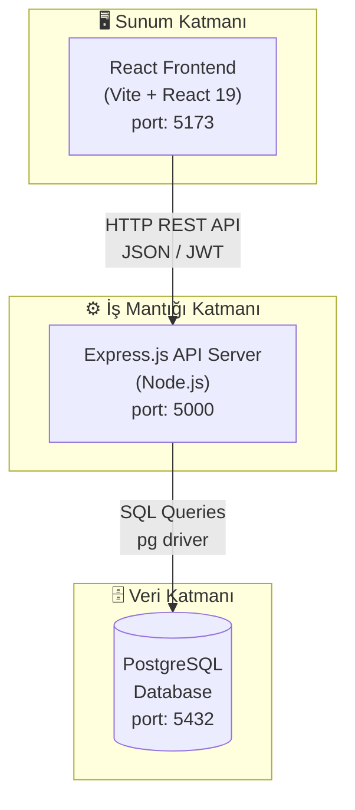

# LifeSync – Yazılım Tasarım Dokümanı (SDD) v1

**Versiyon:** 1.0
**Tarih:** 2025-03-01
**Durum:** Taslak

---

## 1. Giriş

Bu doküman, LifeSync uygulamasının yazılım mimarisi tasarımının ilk versiyonunu içermektedir. Amacı; mimari kararı, üst seviye bileşen yapısını ve bileşenler arası arayüzleri tanımlamaktır.

---

## 2. Mimari Seçimi

### Seçilen Mimari: Katmanlı Mimari (Layered Architecture)

LifeSync projesi için **3 katmanlı (3-tier) Layered Architecture** seçilmiştir.

### Gerekçe

| Kriter | Açıklama |
|--------|----------|
| Bağımsızlık | Her katman yalnızca bir alt katmana bağımlıdır; değişiklikler izole edilir |
| Test edilebilirlik | Katmanlar bağımsız test edilebilir |
| Anlaşılırlık | Takım için açık ve tanıdık bir yapı sunar |
| Bakım kolaylığı | İş mantığı, UI ve veri erişimi birbirinden ayrıdır |
| Ölçeklenebilirlik | İleride katmanlar bağımsız olarak ölçeklenebilir |

Monolitik mimari tercih edilmemiştir çünkü frontend ve backend'in ayrı deploy edilmesi hedeflenmektedir. Event-driven mimari bu proje için gereksiz karmaşıklık yaratacaktır.

---

## 3. Katmanlar

### 3.1 Sunum Katmanı (Presentation Layer)
- React tabanlı Single Page Application (SPA)
- Kullanıcı ile doğrudan etkileşim
- REST API üzerinden iş katmanına bağlanır

### 3.2 İş Mantığı Katmanı (Business Logic Layer)
- Node.js + Express.js REST API sunucusu
- Kimlik doğrulama, kullanıcı yönetimi, sağlık hesaplamaları
- Yapay zeka servisine köprü görevi görür

### 3.3 Veri Katmanı (Data Layer)
- PostgreSQL ilişkisel veritabanı
- Kullanıcı verileri kalıcı olarak burada tutulur

---

## 4. Üst Seviye Bileşen Diyagramı

---

## 5. Bileşenler

### 5.1 React Frontend
- Kullanıcı kayıt ve giriş sayfaları
- Dashboard (kontrol paneli)
- Sağlık anketi formu
- Profil yönetimi

### 5.2 Express.js API Server
- `/api/auth` → Kimlik doğrulama endpoint'leri
- `/api/dashboard` → Dashboard ve anket endpoint'leri
- `/api/profile` → Profil endpoint'leri

### 5.3 PostgreSQL Database
- `users` tablosu: kullanıcı bilgileri

---

## 6. Temel Arayüzler (Üst Seviye)

| Arayüz | Kaynak | Hedef | Protokol |
|--------|--------|-------|----------|
| Frontend → Backend | React App | Express API | HTTP REST |
| Backend → Database | Express API | PostgreSQL | TCP/SQL |

---

## 7. Kısıtlar ve Varsayımlar

- Uygulama başlangıçta tek makine üzerinde çalışacaktır
- Tüm servisler localhost üzerinde konuşlanacaktır
- JWT token ile durumsuz (stateless) kimlik doğrulama kullanılacaktır

---

*Sonraki versiyon: Sınıf diyagramı ve detaylı arayüz parametreleri eklenecektir.*
