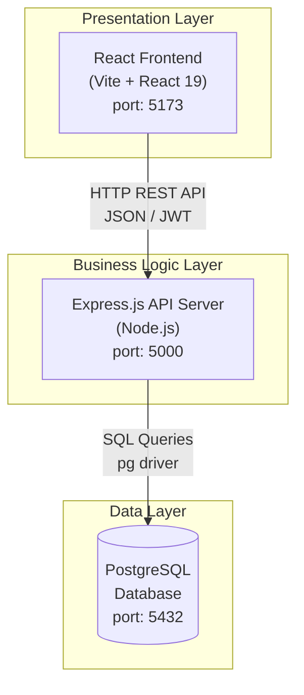

# LifeSync – Software Design Document (SDD) v1

**Version:** 1.0
**Date:** 2025-03-01
**Status:** Draft

---

## 1. Introduction

This document contains the first version of the software architecture design for the LifeSync application. Its purpose is to define the architectural decisions, high-level component structure, and interfaces between components.

---

## 2. Architecture Selection

### Selected Architecture: Layered Architecture

A **3-tier Layered Architecture** has been selected for the LifeSync project.

### Rationale

| Criterion | Description |
|-----------|-------------|
| Independence | Each layer depends only on the layer below; changes are isolated |
| Testability | Layers can be tested independently |
| Clarity | Provides a clear and familiar structure for the team |
| Maintainability | Business logic, UI, and data access are separated from each other |
| Scalability | Layers can be scaled independently in the future |

A monolithic architecture was not preferred because the goal is to deploy the frontend and backend separately. An event-driven architecture would introduce unnecessary complexity for this project.

---

## 3. Layers

### 3.1 Presentation Layer
- React-based Single Page Application (SPA)
- Direct interaction with the user
- Connects to the business layer via REST API

### 3.2 Business Logic Layer
- Node.js + Express.js REST API server
- Authentication, user management, health calculations
- Acts as a bridge to the AI service

### 3.3 Data Layer
- PostgreSQL relational database
- User data is persistently stored here

---

## 4. High-Level Component Diagram

---

## 5. Components

### 5.1 React Frontend
- User registration and login pages
- Dashboard (control panel)
- Health questionnaire form
- Profile management

### 5.2 Express.js API Server
- `/api/auth` → Authentication endpoints
- `/api/dashboard` → Dashboard and questionnaire endpoints
- `/api/profile` → Profile endpoints

### 5.3 PostgreSQL Database
- `users` table: user information

---

## 6. Core Interfaces (High-Level)

| Interface | Source | Target | Protocol |
|-----------|--------|--------|----------|
| Frontend → Backend | React App | Express API | HTTP REST |
| Backend → Database | Express API | PostgreSQL | TCP/SQL |

---

## 7. Constraints and Assumptions

- The application will initially run on a single machine
- All services will be deployed on localhost
- Stateless authentication will be used via JWT tokens

---

*Next version: Class diagram and detailed interface parameters will be added.*
