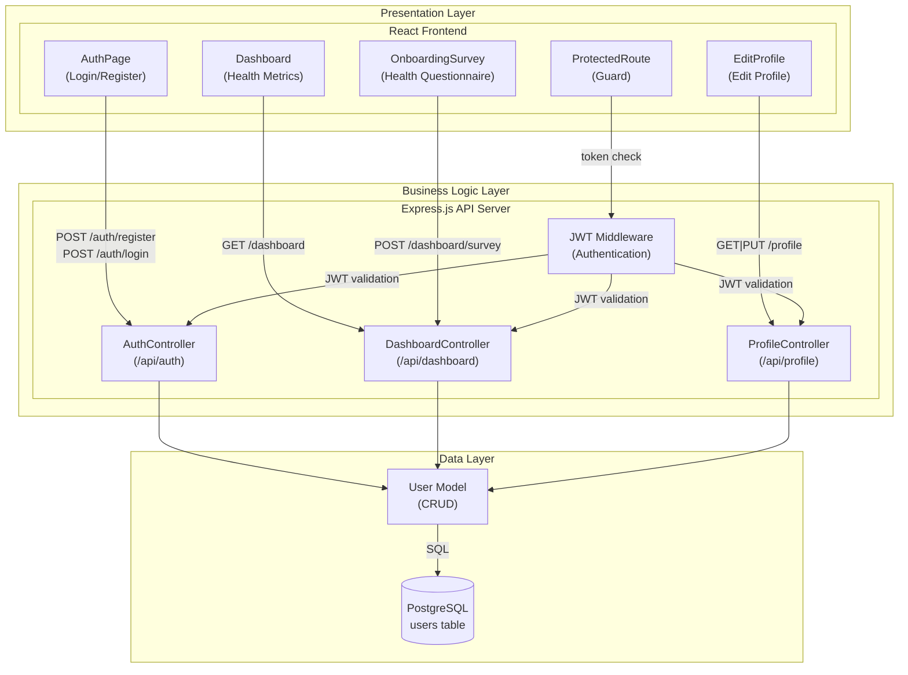
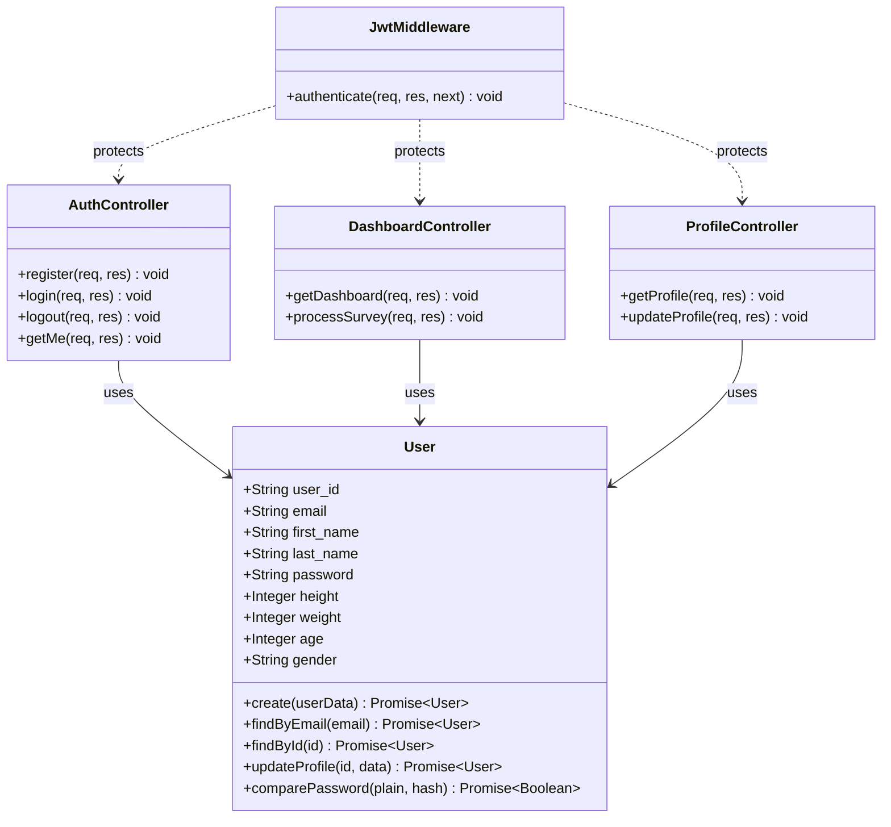

# LifeSync – Software Design Document (SDD) v2

**Version:** 2.0
**Date:** 2025-03-15
**Status:** Current (Post-Sprint 1 Update)

---

## 1. Change Summary (v1 → v2)

- Component diagram expanded: JWT Middleware component added
- Class diagram added (User model, Controllers)
- Interface input/output parameters defined
- Dashboard and survey components added

---

## 2. Architecture: Layered Architecture

The selection remains the same as v1. 3 main layers:

1. **Presentation Layer** → React SPA (port 5173)
2. **Business Logic Layer** → Express.js API (port 5000)
3. **Data Layer** → PostgreSQL (port 5432)

---

## 3. Detailed Component Diagram


---

## 4. Class Diagram


---

## 5. Interface Definitions

### 5.1 POST /api/auth/register

**Input:**
```json
{
  "first_name": "string (required)",
  "last_name": "string (required)",
  "email": "string (required, unique)",
  "password": "string (required, min 6 characters)"
}
```

**Output (200 OK):**
```json
{
  "message": "Registration successful",
  "token": "JWT_TOKEN",
  "user": {
    "user_id": "uuid",
    "email": "string",
    "first_name": "string",
    "last_name": "string"
  }
}
```

---

### 5.2 POST /api/auth/login

**Input:**
```json
{
  "email": "string (required)",
  "password": "string (required)"
}
```

**Output (200 OK):**
```json
{
  "message": "Login successful",
  "token": "JWT_TOKEN",
  "user": { "user_id": "...", "email": "...", "first_name": "...", "last_name": "..." }
}
```

**Output (401 Unauthorized):**
```json
{ "error": "Invalid email or password" }
```

---

### 5.3 GET /api/dashboard

**Header:** `Authorization: Bearer <token>`

**Output (200 OK):**
```json
{
  "user": { "first_name": "...", "last_name": "...", "email": "..." },
  "metrics": {
    "bmi": 22.5,
    "bmi_category": "Normal",
    "height": 170,
    "weight": 65,
    "age": 25,
    "gender": "female"
  }
}
```

---

### 5.4 POST /api/dashboard/survey

**Header:** `Authorization: Bearer <token>`

**Input:**
```json
{
  "age": "integer",
  "gender": "string",
  "height": "integer (cm)",
  "weight": "integer (kg)",
  "goal": "string",
  "diet_preference": "string",
  "allergies": "string",
  "activity_level": "string",
  "exercise_frequency": "integer",
  "sleep_hours": "integer",
  "water_intake": "float",
  "screen_time": "integer",
  "health_notes": "string"
}
```

**Output (200 OK):**
```json
{
  "classification": "Beginner | Intermediate | Advanced",
  "message": "Classification message"
}
```

---

## 6. Database Schema
```sql
CREATE TABLE users (
    user_id    VARCHAR(36)  PRIMARY KEY,
    email      VARCHAR(255) NOT NULL UNIQUE,
    first_name VARCHAR(100) NOT NULL,
    last_name  VARCHAR(100) NOT NULL,
    password   VARCHAR(255) NOT NULL,
    height     INTEGER,
    weight     INTEGER,
    age        INTEGER,
    gender     VARCHAR(10)
);
```

---

*Next version: Ollama integration, sequence diagrams, and deployment diagram will be added.*
