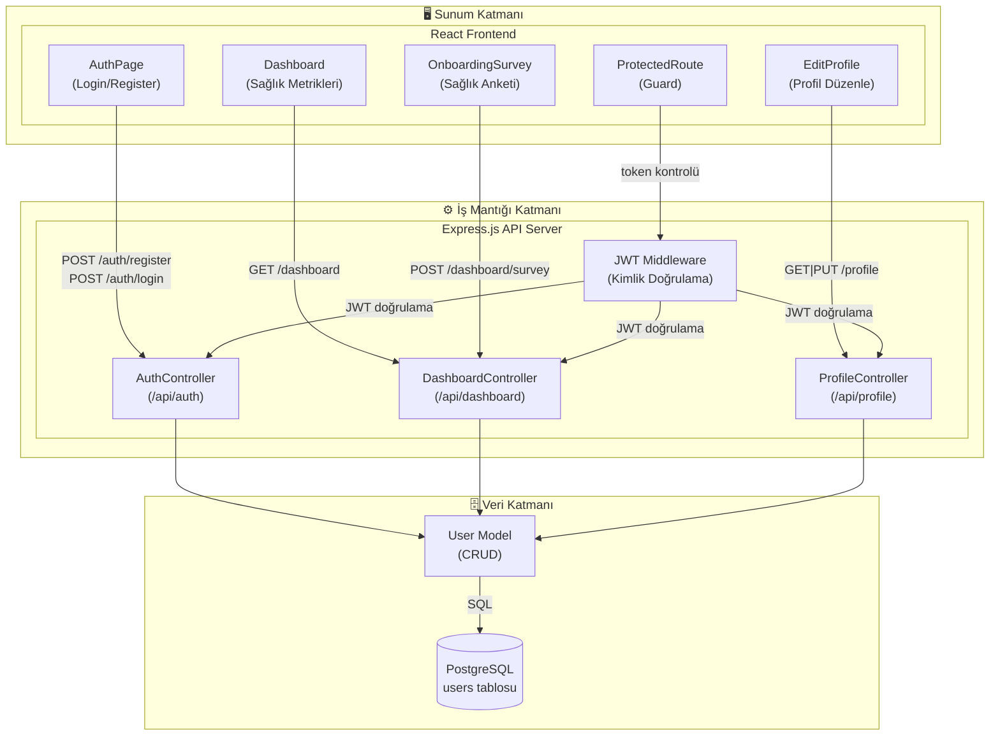

# LifeSync – Yazılım Tasarım Dokümanı (SDD) v2

**Versiyon:** 2.0
**Tarih:** 2025-03-15
**Durum:** Güncel (Sprint 1 sonrası güncelleme)

---

## 1. Değişiklik Özeti (v1 → v2)

- Bileşen diyagramı detaylandırıldı: JWT Middleware bileşeni eklendi
- Sınıf diyagramı eklendi (User modeli, Controller'lar)
- Arayüz input/output parametreleri tanımlandı
- Dashboard ve anket bileşenleri eklendi

---

## 2. Mimari: Katmanlı Mimari (Layered Architecture)

Seçim v1'den itibaren aynıdır. 3 ana katman:

1. **Sunum Katmanı** → React SPA (port 5173)
2. **İş Mantığı Katmanı** → Express.js API (port 5000)
3. **Veri Katmanı** → PostgreSQL (port 5432)

---

## 3. Detaylı Bileşen Diyagramı



---

## 4. Sınıf Diyagramı


---

## 5. Arayüz Tanımları

### 5.1 POST /api/auth/register

**Input:**
```json
{
  "first_name": "string (zorunlu)",
  "last_name": "string (zorunlu)",
  "email": "string (zorunlu, unique)",
  "password": "string (zorunlu, min 6 karakter)"
}
```

**Output (200 OK):**
```json
{
  "message": "Kayıt başarılı",
  "token": "JWT_TOKEN",
  "user": {
    "user_id": "uuid",
    "email": "string",
    "first_name": "string",
    "last_name": "string"
  }
}
```

---

### 5.2 POST /api/auth/login

**Input:**
```json
{
  "email": "string (zorunlu)",
  "password": "string (zorunlu)"
}
```

**Output (200 OK):**
```json
{
  "message": "Giriş başarılı",
  "token": "JWT_TOKEN",
  "user": { "user_id": "...", "email": "...", "first_name": "...", "last_name": "..." }
}
```

**Output (401 Unauthorized):**
```json
{ "error": "Geçersiz email veya şifre" }
```

---

### 5.3 GET /api/dashboard

**Header:** `Authorization: Bearer <token>`

**Output (200 OK):**
```json
{
  "user": { "first_name": "...", "last_name": "...", "email": "..." },
  "metrics": {
    "bmi": 22.5,
    "bmi_category": "Normal",
    "height": 170,
    "weight": 65,
    "age": 25,
    "gender": "female"
  }
}
```

---

### 5.4 POST /api/dashboard/survey

**Header:** `Authorization: Bearer <token>`

**Input:**
```json
{
  "age": "integer",
  "gender": "string",
  "height": "integer (cm)",
  "weight": "integer (kg)",
  "goal": "string",
  "diet_preference": "string",
  "allergies": "string",
  "activity_level": "string",
  "exercise_frequency": "integer",
  "sleep_hours": "integer",
  "water_intake": "float",
  "screen_time": "integer",
  "health_notes": "string"
}
```

**Output (200 OK):**
```json
{
  "classification": "Beginner | Intermediate | Advanced",
  "message": "Sınıflandırma mesajı"
}
```

---

## 6. Veritabanı Şeması

```sql
CREATE TABLE users (
    user_id    VARCHAR(36)  PRIMARY KEY,
    email      VARCHAR(255) NOT NULL UNIQUE,
    first_name VARCHAR(100) NOT NULL,
    last_name  VARCHAR(100) NOT NULL,
    password   VARCHAR(255) NOT NULL,
    height     INTEGER,
    weight     INTEGER,
    age        INTEGER,
    gender     VARCHAR(10)
);
```

---

*Sonraki versiyon: Ollama entegrasyonu, sequence diyagramları ve deployment diyagramı eklenecektir.*
