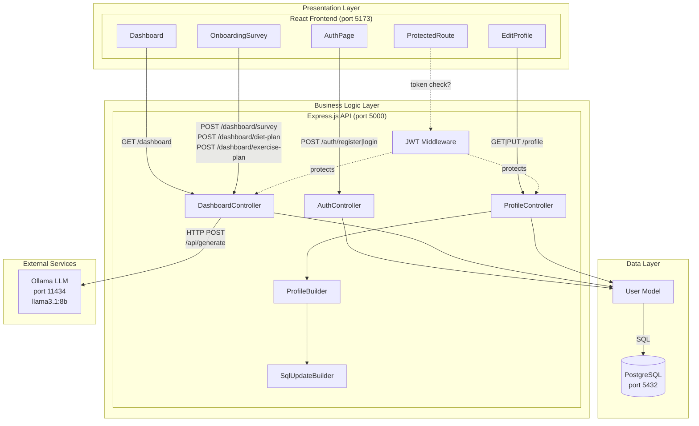
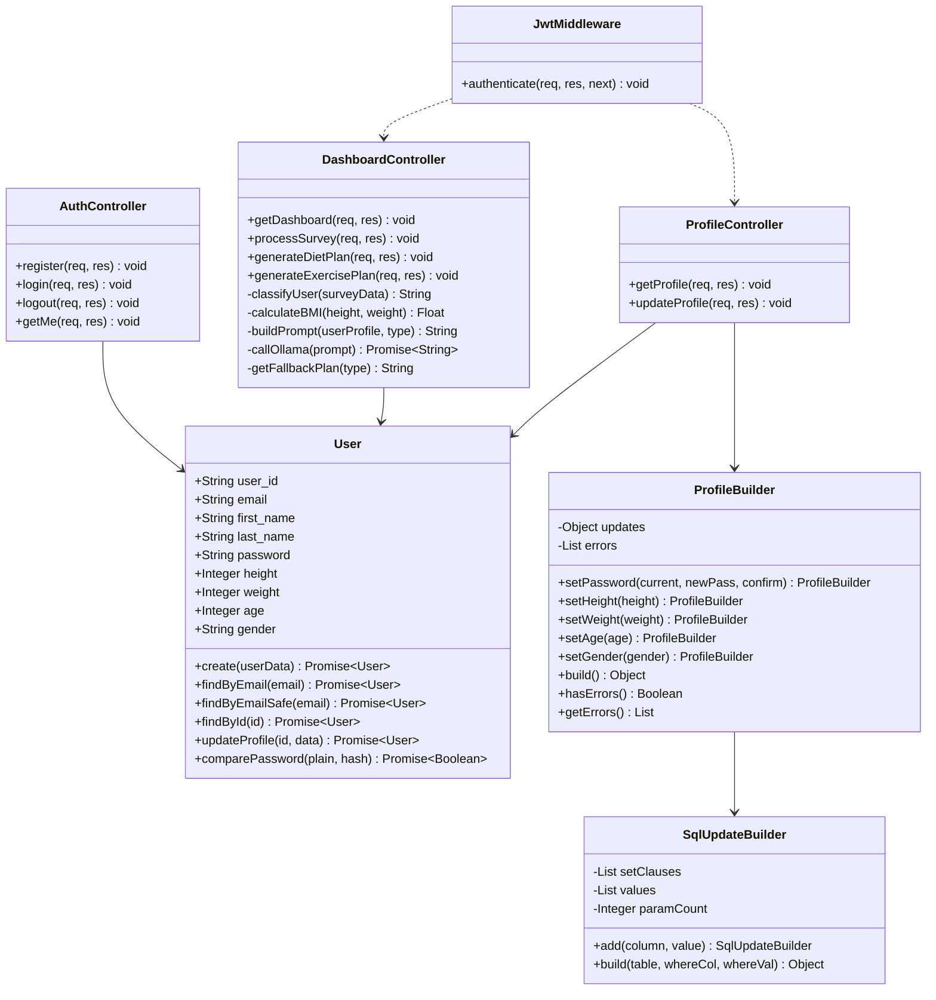
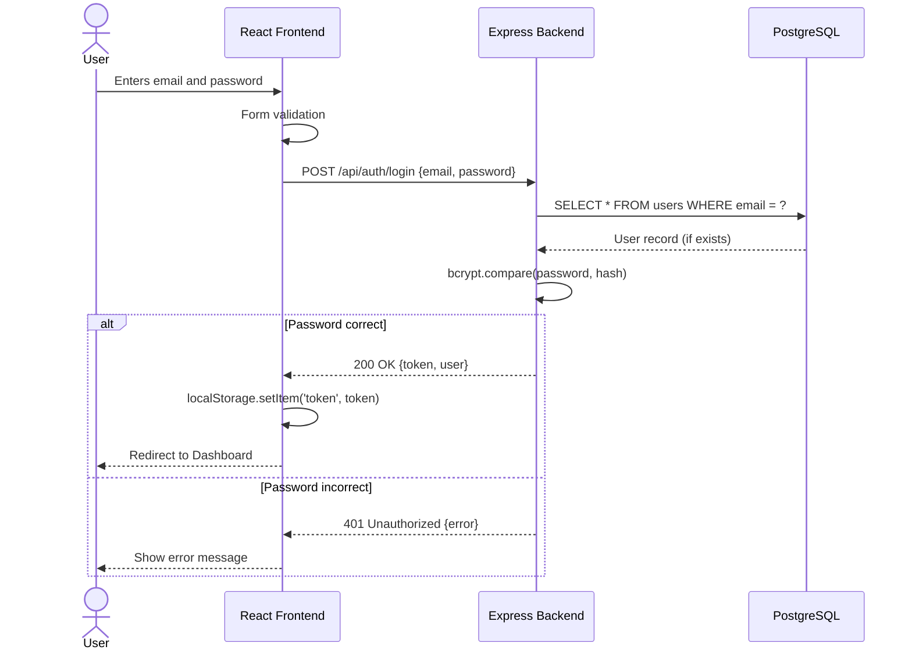
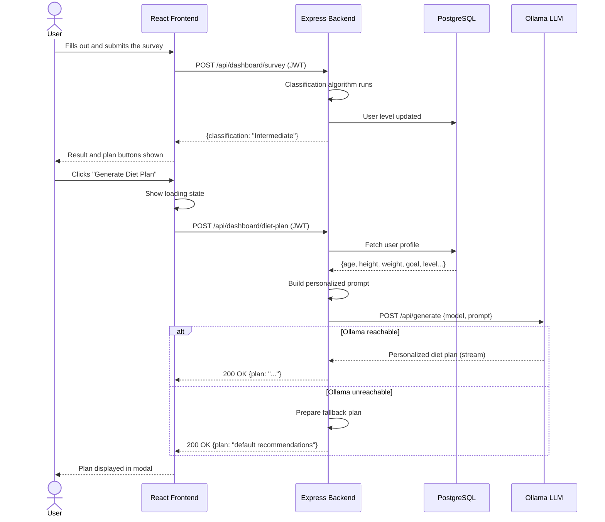
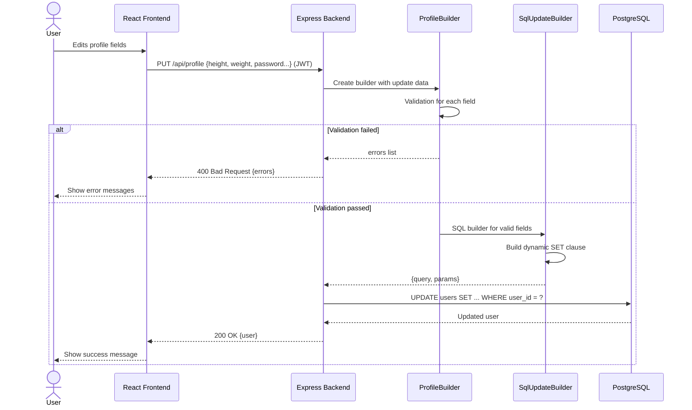
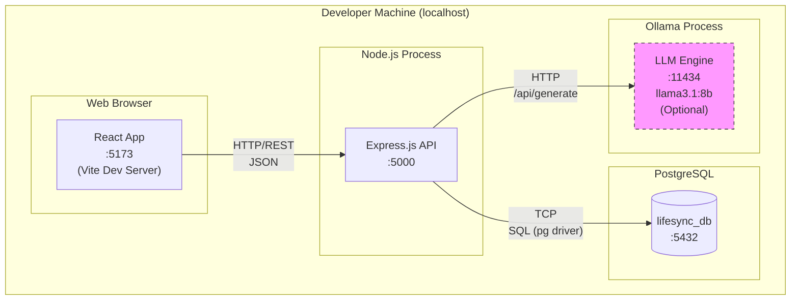

# LifeSync – Software Design Document (SDD) v3

**Version:** 3.0
**Date:** 2025-03-29
**Status:** Final

---

## 1. Change Summary (v2 → v3)

- Ollama LLM service added to the component diagram
- Sequence diagrams added (Login flow, AI Plan generation flow)
- Deployment diagram added
- Builder Pattern included in the class diagram
- Profile update and AI plan interfaces defined

---

## 2. Architecture: Layered Architecture

### 2.1 Layers

| Layer | Technology | Responsibility |
|-------|------------|----------------|
| Presentation | React 19 + Vite | User interface, form management |
| Business Logic | Node.js + Express 5 | Auth, classification, AI integration |
| Data | PostgreSQL | User data persistence |
| External AI | Ollama (llama3.1:8b) | LLM-powered plan generation |

---

## 3. Component Diagram (Full Version)

---

## 4. Class Diagram (Full Version)

---

## 5. Sequence Diagrams

### 5.1 User Login Flow

---

### 5.2 AI-Powered Plan Generation Flow

---

### 5.3 Profile Update Flow

---

## 6. Deployment Diagram

> **Note:** The Ollama service is optional. When unavailable, the system continues in fallback mode.

---

## 7. Full Interface Definitions

### 7.1 Authentication

| Endpoint | Method | Auth | Input | Output |
|----------|--------|------|-------|--------|
| `/api/auth/register` | POST | No | `{first_name, last_name, email, password}` | `{token, user}` |
| `/api/auth/login` | POST | No | `{email, password}` | `{token, user}` |
| `/api/auth/logout` | POST | Yes | — | `{message}` |
| `/api/auth/me` | GET | Yes | — | `{user}` |

### 7.2 Dashboard & Survey

| Endpoint | Method | Auth | Input | Output |
|----------|--------|------|-------|--------|
| `/api/dashboard` | GET | Yes | — | `{user, metrics:{bmi, bmi_category,...}}` |
| `/api/dashboard/survey` | POST | Yes | `{age, gender, height, weight, goal, diet_preference, allergies, activity_level, exercise_frequency, sleep_hours, water_intake, screen_time, health_notes}` | `{classification, message}` |
| `/api/dashboard/diet-plan` | POST | Yes | — | `{plan: string}` |
| `/api/dashboard/exercise-plan` | POST | Yes | — | `{plan: string}` |

### 7.3 Profile

| Endpoint | Method | Auth | Input | Output |
|----------|--------|------|-------|--------|
| `/api/profile` | GET | Yes | — | `{user}` |
| `/api/profile` | PUT | Yes | `{current_password?, new_password?, height?, weight?, age?, gender?}` | `{user}` |

---

## 8. Design Patterns

| Pattern | Class | Purpose |
|---------|-------|---------|
| **Builder** | `ProfileBuilder` | Profile update validation and object construction |
| **Builder** | `SqlUpdateBuilder` | Dynamic SQL UPDATE query generation |
| **MVC** | Controller + Model + Route | Backend layer separation |
| **Middleware** | `JwtMiddleware` | Cross-cutting authentication logic |

---

## 9. Security Decisions

| Decision | Implementation |
|----------|----------------|
| Password hashing | bcrypt, 10 salt rounds |
| Token-based auth | JWT, 7-day TTL |
| SQL injection protection | Parameterized queries (pg prepared statements) |
| Stateless auth | Token stored in localStorage |
