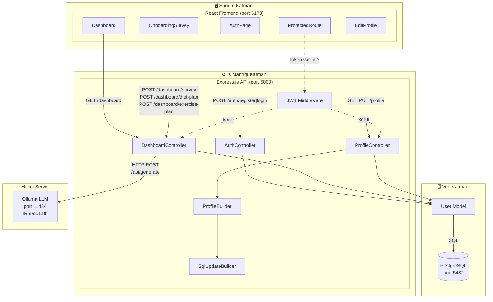
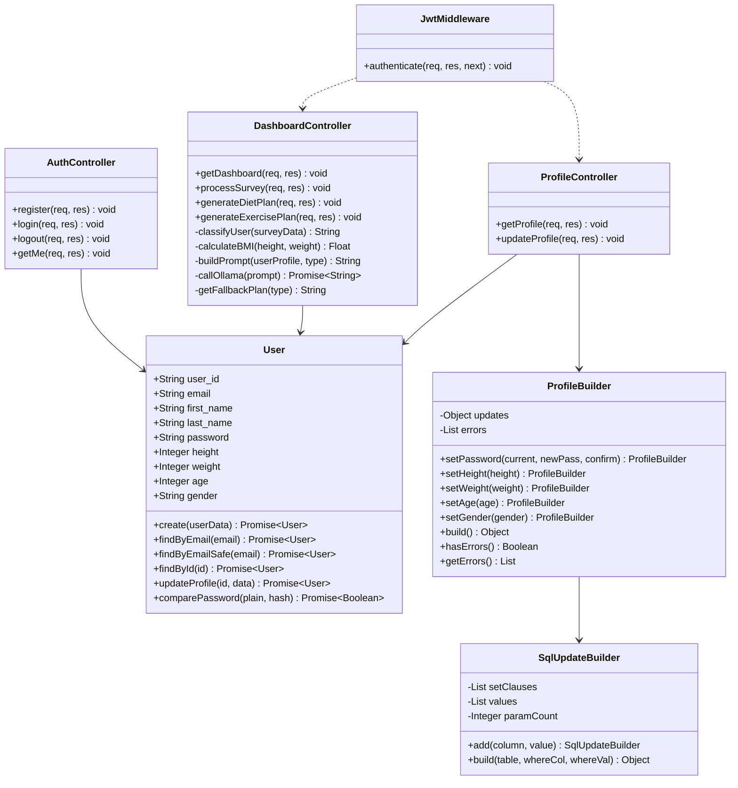
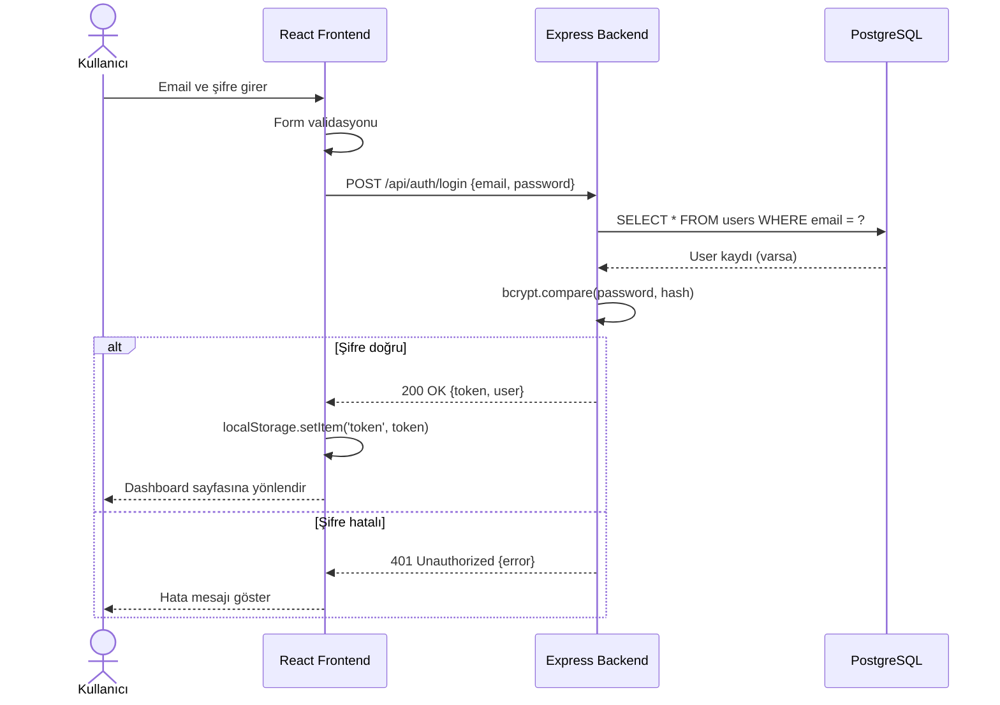
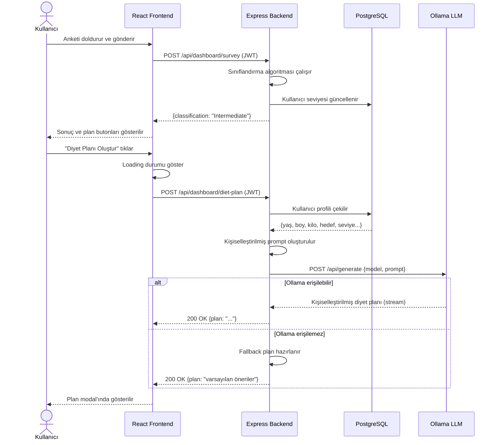
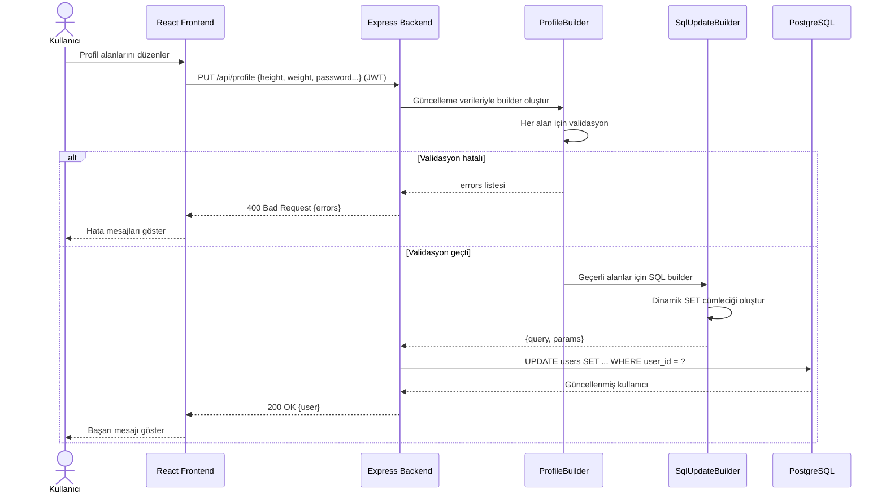
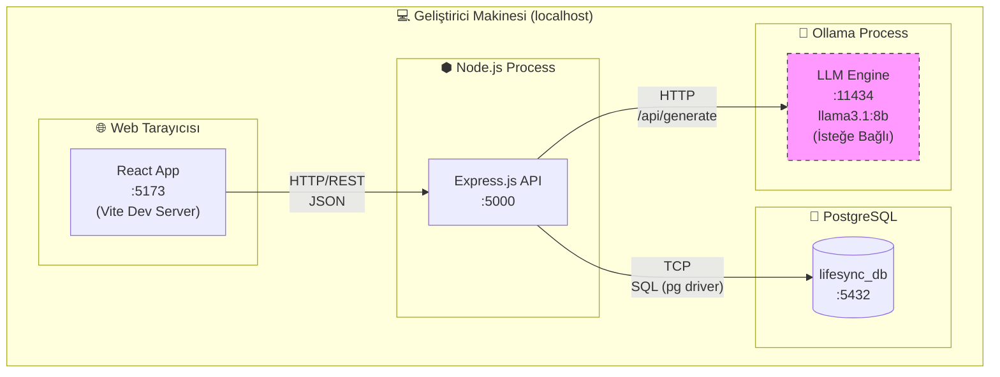

# LifeSync – Yazılım Tasarım Dokümanı (SDD) v3

**Versiyon:** 3.0
**Tarih:** 2025-03-29
**Durum:** Final

---

## 1. Değişiklik Özeti (v2 → v3)

- Ollama LLM servisi bileşen diyagramına eklendi
- Sequence diyagramları eklendi (Login akışı, AI Plan üretimi akışı)
- Deployment diyagramı eklendi
- Builder Pattern sınıf diyagramına dahil edildi
- Profil güncelleme ve AI plan arayüzleri tanımlandı

---

## 2. Mimari: Katmanlı Mimari (Layered Architecture)

### 2.1 Katmanlar

| Katman | Teknoloji | Sorumluluk |
|--------|-----------|------------|
| Sunum | React 19 + Vite | Kullanıcı arayüzü, form yönetimi |
| İş Mantığı | Node.js + Express 5 | Auth, sınıflandırma, AI entegrasyonu |
| Veri | PostgreSQL | Kullanıcı verisi kalıcılığı |
| Harici AI | Ollama (llama3.1:8b) | LLM destekli plan üretimi |

---

## 3. Bileşen Diyagramı (Tam Versiyon)

---

## 4. Sınıf Diyagramı (Tam Versiyon)

---

## 5. Sequence Diyagramları

### 5.1 Kullanıcı Giriş Akışı

---

### 5.2 AI Destekli Plan Üretimi Akışı

---

### 5.3 Profil Güncelleme Akışı

---

## 6. Deployment Diyagramı

> **Not:** Ollama servisi isteğe bağlıdır. Çalışmadığında sistem fallback modda devam eder.

---

## 7. Tüm Arayüz Tanımları

### 7.1 Kimlik Doğrulama

| Endpoint | Method | Auth | Input | Output |
|----------|--------|------|-------|--------|
| `/api/auth/register` | POST | Hayır | `{first_name, last_name, email, password}` | `{token, user}` |
| `/api/auth/login` | POST | Hayır | `{email, password}` | `{token, user}` |
| `/api/auth/logout` | POST | Evet | — | `{message}` |
| `/api/auth/me` | GET | Evet | — | `{user}` |

### 7.2 Dashboard & Anket

| Endpoint | Method | Auth | Input | Output |
|----------|--------|------|-------|--------|
| `/api/dashboard` | GET | Evet | — | `{user, metrics:{bmi, bmi_category,...}}` |
| `/api/dashboard/survey` | POST | Evet | `{age, gender, height, weight, goal, diet_preference, allergies, activity_level, exercise_frequency, sleep_hours, water_intake, screen_time, health_notes}` | `{classification, message}` |
| `/api/dashboard/diet-plan` | POST | Evet | — | `{plan: string}` |
| `/api/dashboard/exercise-plan` | POST | Evet | — | `{plan: string}` |

### 7.3 Profil

| Endpoint | Method | Auth | Input | Output |
|----------|--------|------|-------|--------|
| `/api/profile` | GET | Evet | — | `{user}` |
| `/api/profile` | PUT | Evet | `{current_password?, new_password?, height?, weight?, age?, gender?}` | `{user}` |

---

## 8. Tasarım Desenleri

| Desen | Sınıf | Kullanım Amacı |
|-------|-------|----------------|
| **Builder** | `ProfileBuilder` | Profil güncelleme validasyonu ve nesne inşası |
| **Builder** | `SqlUpdateBuilder` | Dinamik SQL UPDATE sorgusu oluşturma |
| **MVC** | Controller + Model + Route | Backend katman ayrımı |
| **Middleware** | `JwtMiddleware` | Kesişen kimlik doğrulama mantığı |

---

## 9. Güvenlik Kararları

| Karar | Uygulama |
|-------|----------|
| Şifre hashleme | bcrypt, 10 salt round |
| Token tabanlı auth | JWT, 7 gün TTL |
| SQL injection koruması | Parametreli sorgular (pg prepared statements) |
| Stateless auth | Token localStorage'da tutulur |
